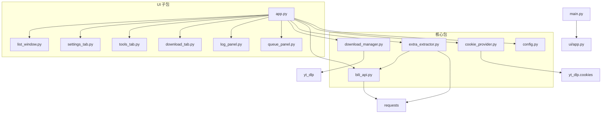

# 维护说明书 — B站视频下载器

---

## 1. 架构总览



**依赖方向：** `ui/` → 核心包 → 第三方库。核心包模块之间仅 `extra_extractor` → `bili_api` 存在单向依赖，其余模块相互独立。

---

## 2. 模块职责表

### 核心包 `bili_downloader/`

| 文件 | 职责 | 关键类/函数 | 外部依赖 |
|------|------|------------|----------|
| `config.py` | 配置持久化，JSON 读写 | `ConfigStore` | 无 |
| `cookie_provider.py` | Cookie 获取，三种模式统一接口 | `CookieProvider` | `yt_dlp.cookies` |
| `bili_api.py` | B站 API 封装（视频信息、合集解析） | `BiliAPI`, `VideoEntry` | `requests` |
| `extra_extractor.py` | 字幕/封面/评论提取 | `extract_subtitle()`, `extract_cover()`, `extract_comments()` | `requests`, `bili_api` |
| `download_manager.py` | 下载队列引擎，事件驱动 | `DownloadManager`, `DownloadTask` | `yt_dlp` |

### UI 子包 `bili_downloader/ui/`

| 文件 | 职责 | 关键类 |
|------|------|--------|
| `app.py` | 主窗口，组装模块，注册事件回调 | `BiliDownloader` |
| `download_tab.py` | 下载面板：URL输入、按钮（添加/开始/暂停/跳过） | `DownloadTab` |
| `tools_tab.py` | 工具面板：字幕/封面/评论提取入口 | `ToolsTab` |
| `settings_tab.py` | 设置面板：下载路径、Cookie模式、格式选择 | `SettingsTab` |
| `queue_panel.py` | 下载队列 TreeView，右键菜单，进度刷新 | `QueuePanel` |
| `list_window.py` | 合集列表弹窗（Toplevel），支持多选添加 | `ListWindow` |
| `log_panel.py` | 全局日志面板，带时间戳和级别着色 | `LogPanel` |

---

## 3. 数据流

### 3.1 下载管线

```
用户粘贴 URL → DownloadTab.get_urls()
    → app._on_add_queue()
        → dm.add_tasks(urls, mode)     # 批量创建 DownloadTask，状态=WAITING
        → queue_panel._rebuild_rows()  # 刷新 TreeView

用户点击"开始"
    → app._on_start()
        → dm.start()                   # 启动 worker 线程

Worker 线程 (_worker):
    loop:
        _next_waiting()                # 取第一个 WAITING 任务
        _download_one(task):
            task.status = DOWNLOADING
            emit("task_update")
            ydl.extract_info(url, download=True)   # yt-dlp 下载
                → progress_hook(d):              # 每 0.5s 发射 task_update
                    检查 _cancel_event.is_set()  # 暂停/跳过中断点
            task.status = COMPLETED / FAILED / CANCELLED
            emit("task_update")
    → emit("all_completed", ...)       # 队列清空

主线程 (queue_panel):
    收到 task_update → root.after(0, _on_task_update)
        → 更新 TreeView 行内容（title/status/progress）
    收到 all_completed → root.after(0, _on_download_all_finished)
        → 恢复按钮状态
```

### 3.2 暂停/跳过机制

使用两个 `threading.Event`：

| 事件 | 用途 | 触发方式 |
|------|------|----------|
| `_pause_event` | 阻止 worker 取下一个任务 | `pause()` / `resume()` |
| `_cancel_event` | 中止正在下载的任务 | `pause()` → 暂停型；`cancel_current()` → 跳过型 |

辅助标志 `_cancel_skip`：
- `False`（暂停型）：下载被中断后，任务回退为 `WAITING`，下次恢复自动续传（yt-dlp 保留 `.part`）
- `True`（跳过型）：下载被中断后，任务标记 `CANCELLED`

### 3.3 提取管线

```
用户在工具面板输入 URL → app._on_extract(action_type)
    → 后台线程:
        BiliAPI.get_video_info(url)        # 解析 bvid/cid/标题
        → extract_subtitle / extract_cover / extract_comments
            → _resolve_video()              # 内部复用 bili_api
            → B站 API 请求 / 字幕 CDN 下载
            → 文件写入 output_dir
    → 主线程: app._on_extract_done(result)
        → log_panel 显示结果
```

---

## 4. 事件系统

`DownloadManager` 使用观察者模式，通过 `on(event, callback)` 注册，`_emit(event, *args)` 触发。

所有回调在 **worker 线程**中调用，UI 层通过 `root.after(0, callback)` marshal 到主线程。

| 事件名 | 参数 | 触发时机 | 消费方 |
|--------|------|----------|--------|
| `task_update` | `(task: DownloadTask)` | 任务状态/进度/标题变更 | `QueuePanel._on_task_update` |
| `all_completed` | `(waiting, completed, failed)` | 队列全部处理完毕 | `app._on_download_all_finished` |
| `log` | `(msg: str)` | 下载过程中的错误日志 | `queue_panel` (转发到全局 log) |

注册示例（`app._register_dm_events`）：

```python
self.dm.on("all_completed", self._on_download_all_finished)
# queue_panel 内部注册 task_update 和 log
```

---

## 5. UI 布局

单窗口三栏 grid 布局，`weight` 比例 7:4:6，无可拖拽边界：

```
┌────────────────────────────────────┐
│  Tab Notebook (weight=7)           │
│  ┌ 视频下载 ┌ 字幕/更多 ┌ 设置 ┐   │
│  │ URL输入 + 按钮 + 选项     ... │  │
│  └────────────────────────────┘   │
├────────────────────────────────────┤
│  任务队列 TreeView (weight=4)      │
│  [标题 | 状态+进度 | 类型+大小]    │
├────────────────────────────────────┤
│  全局日志 (weight=6)               │
│  [时间戳] [级别] 消息...           │
└────────────────────────────────────┘
```

按钮状态机（下载流程）：

```
初始: [开始=可用] [暂停=禁用] [跳过=禁用]
    ↓ 点击开始
运行中: [开始=禁用] [暂停=可用] [跳过=可用]
    ↓ 点击暂停
已暂停: [开始=可用] [暂停=禁用+"已暂停"] [跳过=禁用]
    ↓ 点击开始(再次)
恢复: 同"运行中"
    ↓ 全部完成
结束: 同"初始"
```

---

## 6. 配置系统

`ConfigStore` — 基于 JSON 文件的 key-value 存储，所有读写在主线程中同步完成。

**持久化字段：**

| Key | 类型 | 默认值 | 说明 |
|-----|------|--------|------|
| `download_path` | str | `~/Downloads` | 下载/提取输出目录 |
| `cookie_method` | str | `"browser"` | Cookie 模式：browser / file / none |
| `browser` | str | `"chrome"` | 浏览器类型：chrome / edge / firefox |
| `cookie_file` | str | `""` | Cookie 文件路径（仅 file 模式） |
| `mode` | str | `"best"` | 默认画质：best / 720 / 480 / audio |

**文件位置：** 项目根目录 `bili_downloader_config.json`（已在 `.gitignore` 中排除）。

---

## 7. 线程安全策略

- **核心包**：无 UI 依赖，无共享状态（除 `DownloadManager.tasks` 受 `_lock` 保护），可在任意线程调用
- **UI 包**：所有 tkinter 操作必须在主线程执行。后台线程通过 `root.after(0, callback)` 将结果调度到主线程
- **进度回调**：`yt_dlp` 的 `progress_hook` 在 worker 线程调用，内部做了节流（0.5s 最小间隔）以减少 `after()` 积压

---

## 8. 新增功能指南

### 添加新的下载格式

1. 在 `download_manager.py` 的 `FORMAT_LABELS` 字典中添加新条目
2. 在 `app.py` 的 `_build_ydl_opts()` 中添加对应的 `elif` 分支配置 yt-dlp 参数
3. 在 `download_tab.py` 的下拉选项中添加新选项

### 添加新的提取工具

1. 在 `extra_extractor.py` 中添加新的提取函数，签名参考 `extract_subtitle()`
2. 在 `tools_tab.py` 中添加新按钮
3. 在 `app.py` 的 `_on_extract()` 中添加对应的 `elif` 分支，调用新函数并将结果传入 `_on_extract_done()`

### 添加新事件

1. `DownloadManager` 中通过 `_emit("new_event", data)` 发射
2. 调用方通过 `dm.on("new_event", handler)` 注册回调
3. 确保 handler 中通过 `root.after(0, ...)` 安全调度到主线程

---

## 9. 常见问题排查

### 字幕提取返回"没有可用字幕"

1. **Cookie 无效** — 字幕 API (`player/v2`) 需要登录态。检查 Cookie 是否过期或格式是否正确。
2. **cid 为 0** — `bili_api.get_video_info()` 未能解析正确的分P cid。检查 `pages` 列表和 `raw['cid']` 回退逻辑。
3. **字段名变更** — B站 API 可能使用 `subtitles` 或 `list` 字段。代码已同时尝试两者。
4. **CDN 请求被拒** — 检查 `Referer` header 是否正确设置为 `https://www.bilibili.com/video/{bvid}`。

### Cookie 失效

1. 浏览器模式：确认已登录 B站，且浏览器版本与 `yt-dlp` 兼容
2. 文件模式：重新导出 Cookie 文件（Netscape 格式），确保 `bilibili_cookies.txt` 在项目根目录

### ffmpeg 未找到

程序自动将 `ffmpeg-7.1.1-essentials_build/bin/` 加入 `PATH`。如果仍报错：
1. 确认 `ffmpeg.exe` 存在于该目录
2. 检查杀毒软件是否误删了 `.exe` 文件
3. 可手动将 `bin/` 目录加入系统 `PATH` 环境变量

### 下载无速度或报网络错误

1. B站可能对 IP 做了限速或风控。尝试更换代理或等待一段时间
2. 检查 `_build_ydl_opts()` 中的 `http_headers` 是否包含有效的 `User-Agent` 和 `Referer`